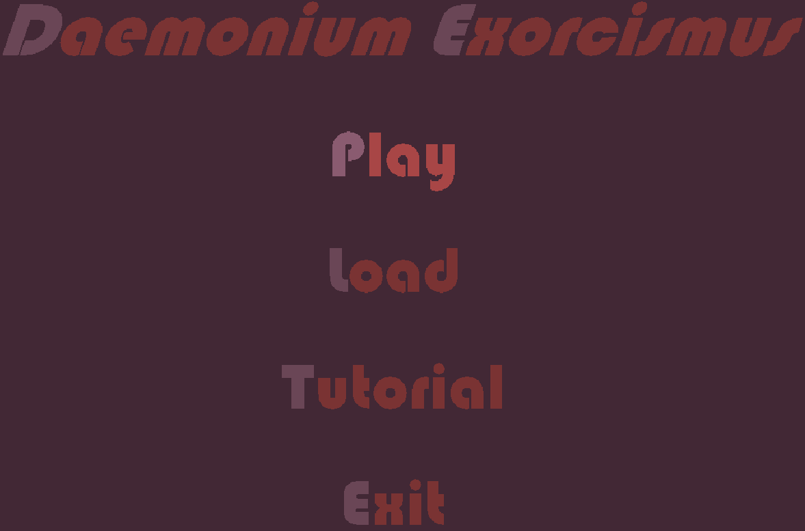
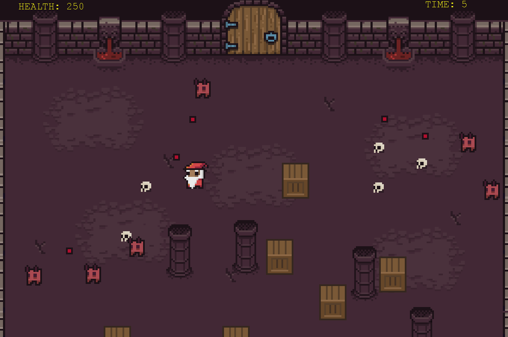

# Daemonium Exorcismus

This is a game made for a school assignment. It features a custom engine with an entity-component-system,
custom asset management and a save/load mechanic linked to SQLite. Below is the architecture of the engine: 

Screenshots from the game:

